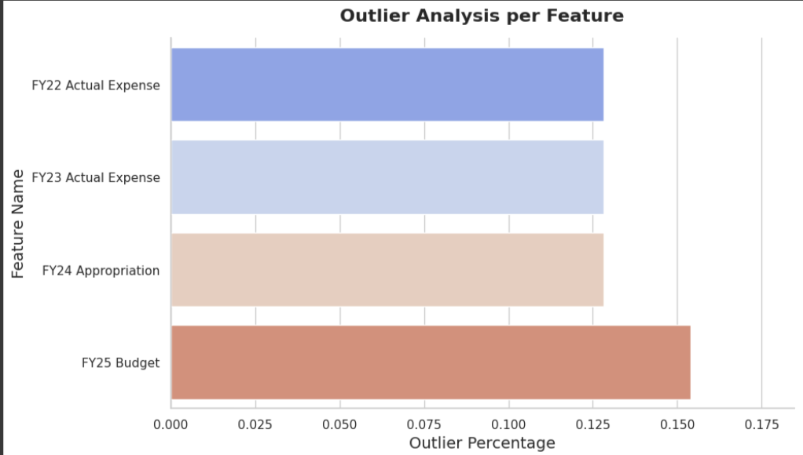
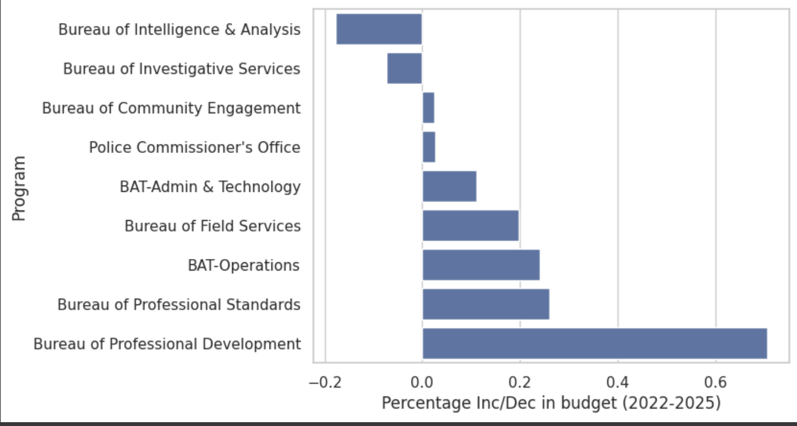
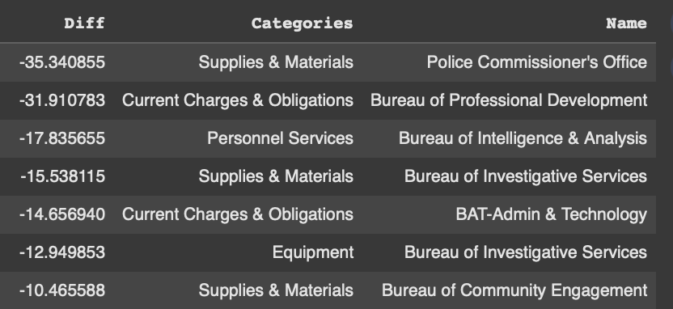
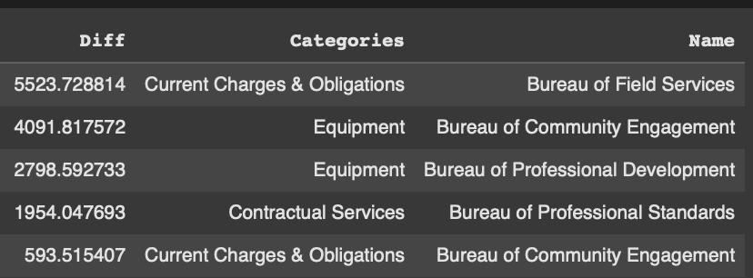
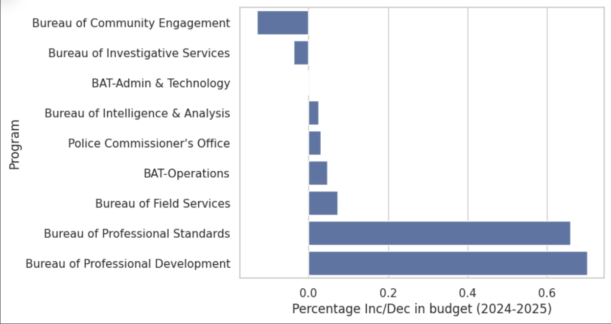

# CS-506

This is the project repository for CS 506: Computational Tools for Data Science

## Dataset Cleaning :

### **_Dataset 1 : Operating Budgets_**

The cleaning process of the data started with the visualization of the data frame. The following points below highlights the steps taken.

**_1. Filtering :_**

The dataset consisted of lots of irrelevant departments that were not necessary for the analysis of BPD (Boston Police department). The dataset was filtered on the BPD prior to the handling of missing values, outliers and other analysis.

**_2. Missing values :_**

The missing values within the dataframe were isolated. The missing values were labelled in the original dataset as “#Missing”. 

**_3. Datatypes :_**

Numerical columns such as Year wise Budget were interpreted as “Object” Datatype. The respective columns were converted into a floating type datapoint for easier analysis and to extract the relevant statistics out of them.  

## Outlier Detection :

### **_Dataset 1 : Operating Budgets_**

InterQuartile Range (IQR) was used to detect the outliers. Each of the numerical feature columns 3rd Quartile and 1st Quartile were obtained and then the values exceeding the quartile and the IQR*1.5 combined were identified. Post that, Manual eyeballing of the data to confirm if indeed the presented values were outliers was used. 

## Visualization and Insights :

### **_Dataset 1 : Operating Budgets_**

Boston Police Department has undergone varying shifts between the years 2022 and 2025. While the overall budget has indeed increase between the given time frames, there are certain expense categories and intra-department allocations that have experienced significant fluctuations and changes. 

**_1. General Trends :_**

The overall budget has increased from 2022 to 2025 for most of the departments. This suggests an increased emphasis on most of the department activities. The increase has been seen on various expense categories ranging from equipments to personnel across which the trend is overall increasing however with notable fluctuations.

The below diagram highlights the increase/decrease in budgets across departments between 2022-2025

_**2. Significant areas where budget was reduced :**_

One of the important insights that was derived from this analysis is that of the reduction in the prioritization of intelligence focused spending. 

Bureau of Investigative services saw a cut across various different expense categories between the fiscal years of 2022 and 2025. This signifies the shift from investigative services. 

The police commissioner’s office has reduced the budget for Supplies and Materials by 35% between 2022-2025.

The Bureau of Intelligence & Analysis saw a decreasing trend in its budget from 2022-2023-2024 with a slight recovery (increase) in budget from 2024-2025

**_3. Significant areas where budget was increased :_**

Most of the department and expense categories within each department saw an increase in their budgets. The increase in budget was observed across majority of the expense categories with a special focus on the equipments, contractual services and the Current Charges and Obligations.

One of the interesting trends uncovered was that of the expense category “Current Charges and Obligations” under the Bureau of Field Services. It saw a staggering 5523% increase in budget between 2022 and 2025. This suggests a major operational expansion. 

Equipments expenses underneath the Bureau of Community Engagement and Bureau of Professional Development saw a dramatic increase in its budget of 4091% and 2798% respectively. This suggests an increased attempt at public initiatives, and training the personnel with the latest modern technological standards. 

Across many departments, Contractual services have seen sharp rises with the highest being noted for Bureau of Professional Standards. 

One interesting trend that can be observed is that of the Bureau of Community Engagement. Although many expense categories within this department have seen a staggering increase in its budget and the overall trend between 2022 and 2025 also suggest an increase in the budget, between the years of 2024 and 2025, It has faced cuts in funding. 

**_4. Shifts in Funding between Departments :_**

Most of the department saw an increase in their budgets from 2022 to 2025 except the Bureau of Intelligence and Analysis & Bureau of Investigative Services.

Bureau of Community Engagement saw a growth between 2022-2024 and from 2024-2025, a cut in budget has been observed.

The below diagram highlights the increase/decrease in budgets across departments between 2024-2025

The personnel services under the Bureau of Intelligence and Analysis saw a major decrease in its funding. The budget for this department started mildly recovering from 2024.

Bureau of Investigative Services saw a decline in its budget from 2022 to 2025 and also across much of its expense category. It did not see a positive growth even from the fiscal year 2024 unlike the Intelligence and Analysis department. This heavily signifies the reduced emphasis on investigative resources. 

