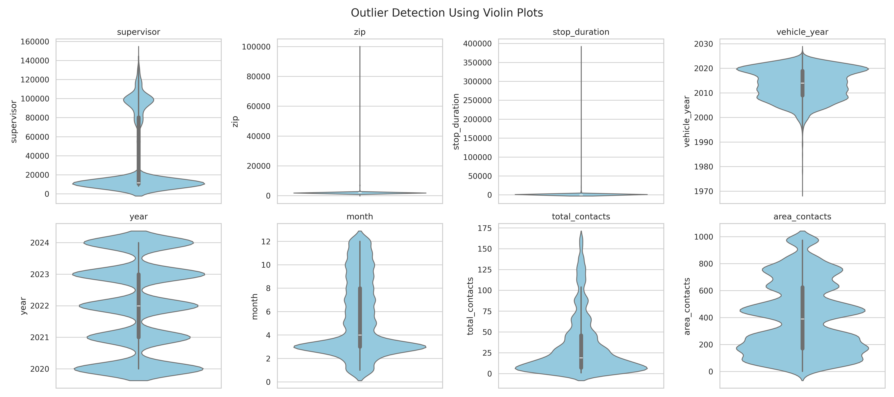
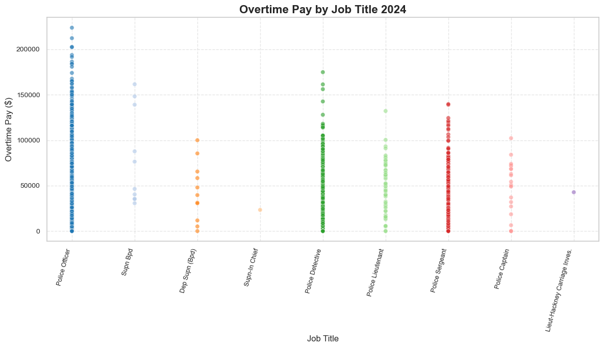
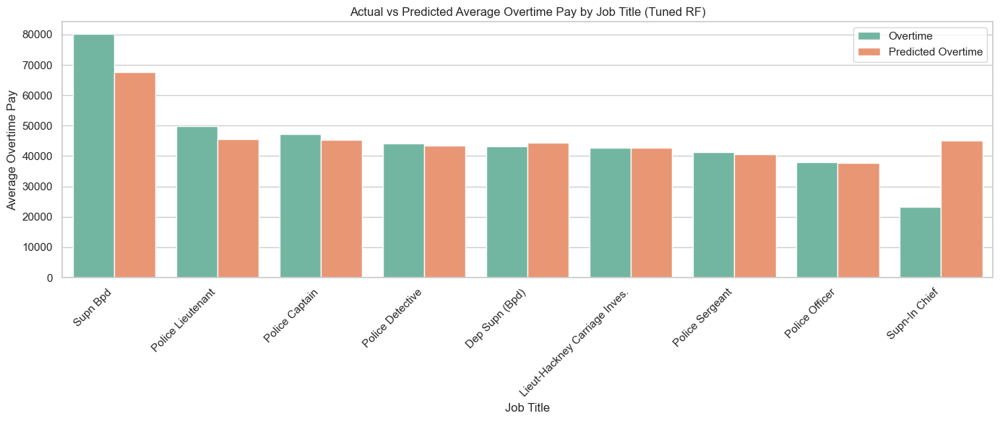
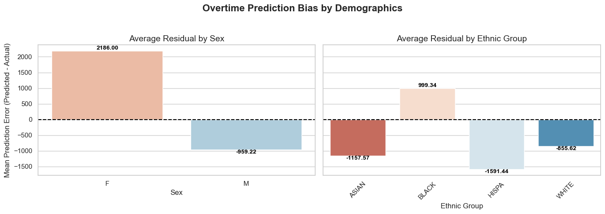
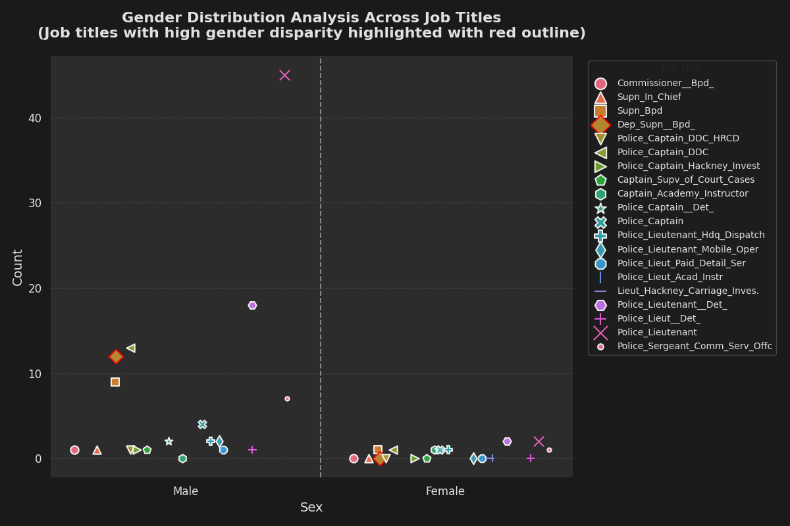
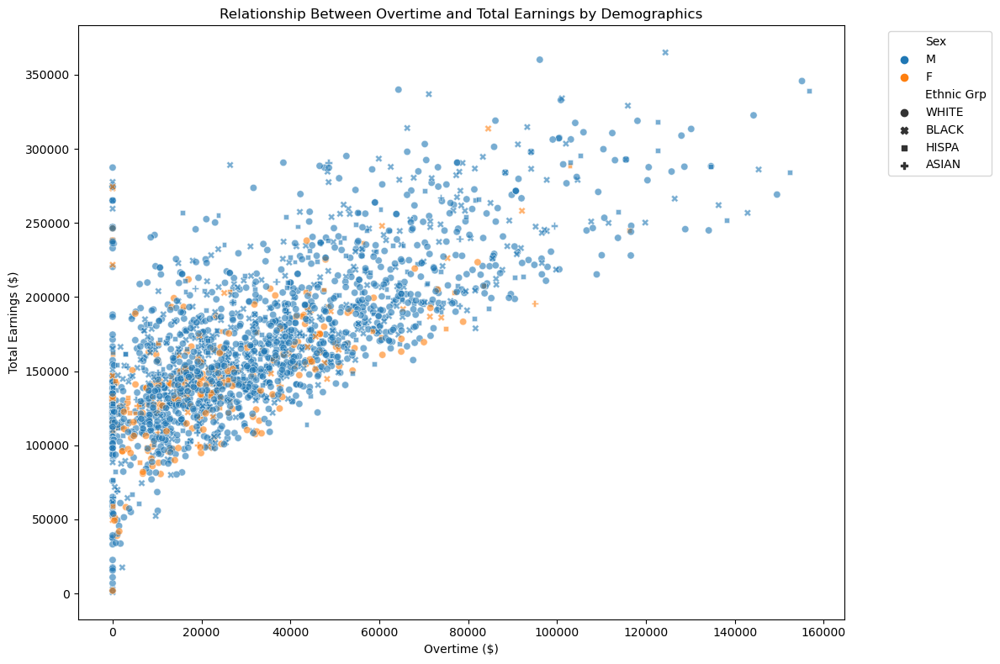
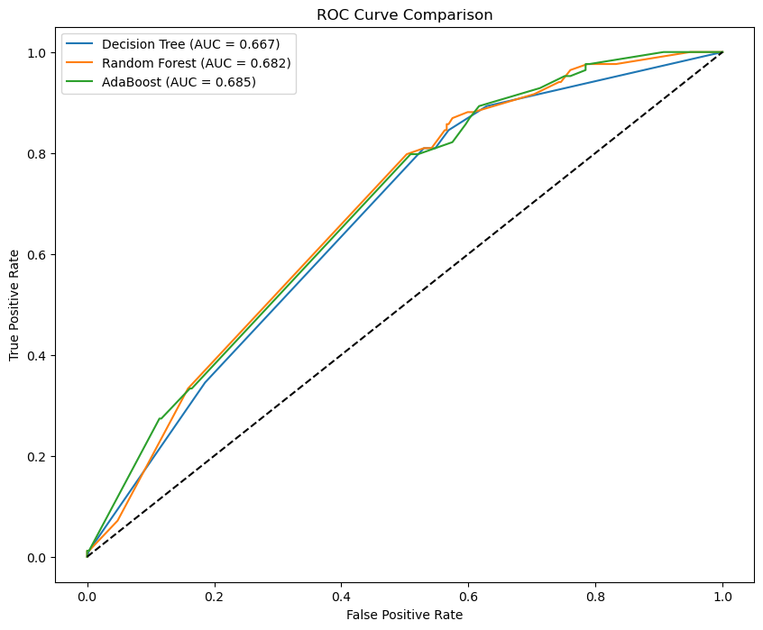
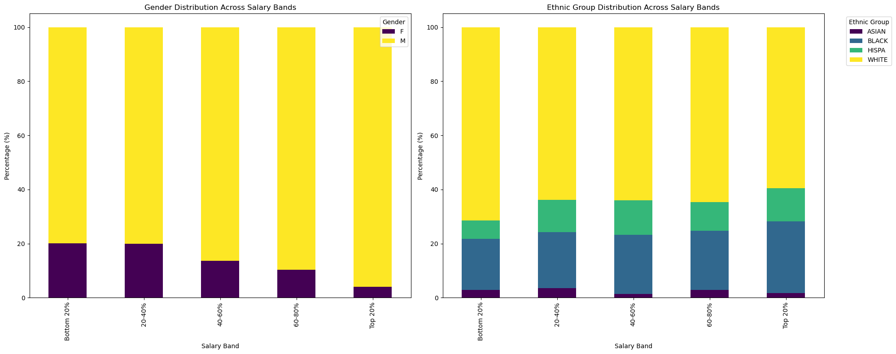
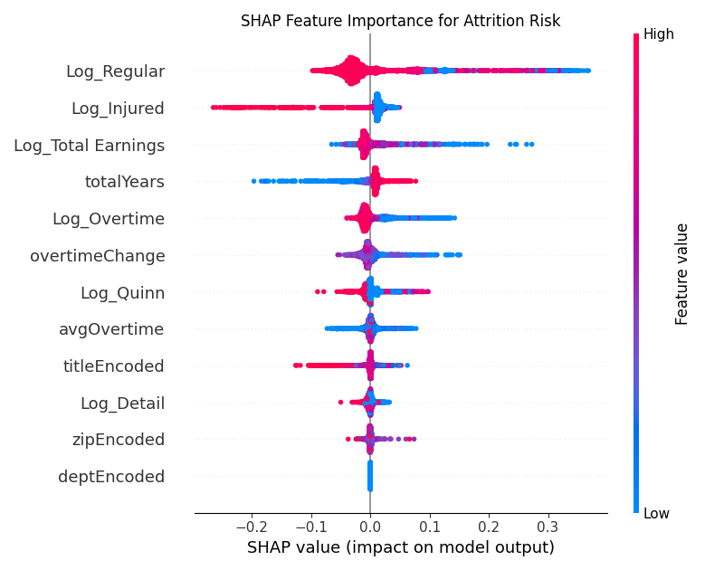
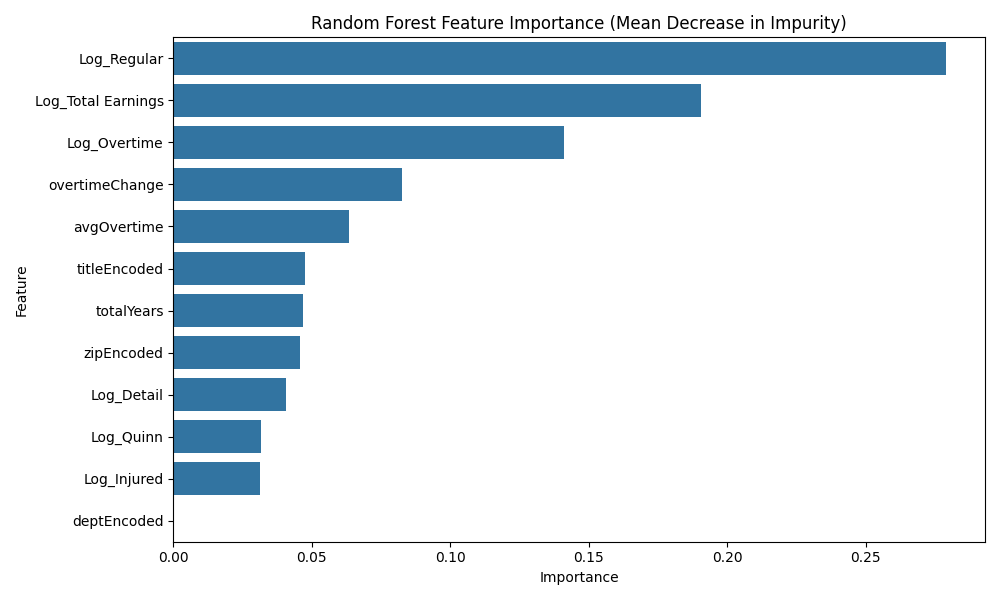

# CS-506

This is the project repository for CS 506: Computational Tools for Data Science


## Link to Presentation

https://youtu.be/2GusWFGZqok

## Dataset Preprocessing :

The cleaning process of the data started with the visualization of the data frame. The following points below highlights the steps taken.

### **_Dataset 1 : Operating Budgets_**

**_1. Filtering :_**

The dataset consisted of lots of irrelevant departments that were not necessary for the analysis of BPD (Boston Police department). The dataset was filtered on the BPD prior to the handling of missing values, outliers and other analysis.

**_2. Missing values :_**

The missing values within the dataframe were isolated. The missing values were labelled in the original dataset as “#Missing”. 

**_3. Datatypes :_**

Numerical columns such as Year wise Budget were interpreted as “Object” Datatype. The respective columns were converted into a floating type datapoint for easier analysis and to extract the relevant statistics out of them.  


### **_Dataset 2 : Employees Earnings Data_**


**_1. Aggregation :_**

For the employees earnings data, the datasets were from each year from 2011-2024. These datasets had to be combined into one large dataframe for each year. Secondly, a mapping of column names had to be used to ensure that all the datasets have the same features for the combination. As both BPD and non-BPD is used for the analysis of this dataset, all the different departments were kept. 

**_2. Missing values :_**

The majority of missing values were seen in columns where a employee did not receive pay for a certain category. These were set to be 0 as that is a true reflection of that column as then did not receive overtime, injury or retro pay for that given time period.


**_3. Zip-Code :_**

Finally, the zip codes were adjusted to be all in the same format, which can be used to see difference in average earnings for each zip code in the state of Massachusetts.

### **_Dataset 3 : Field Interrogation and Observation_**


**_1.Filtering :_**
The dataset was preprocessed by removing duplicate records and unnecessary columns, ensuring that only relevant information remains. A year column was added to distinguish records from different files when combining multiple datasets. Additionally, invalid or inconsistent entries in categorical and numerical fields were cleaned and standardized.

**_2. Missing values :_**
Columns with missing values were filled with NaN where appropriate. For categorical fields like weather, missing values were retained as NaN to indicate no recorded information. In numerical fields, values were converted to proper data types, and records with excessive missing data were reviewed.

**_3. Features :_**
Several new features were engineered to enhance the analysis. These include day of the week, time of day, stop duration category, whether the stop occurred on a weekend, and whether it was a vehicle interaction. Other features like total contacts per area and supervisor involvement were also derived to support further exploration. These new variables help in analyzing trends and behavior patterns.

**_4. Text Classification :_**
The contact_reason column, which contains text descriptions of why an interaction occurred, was processed using text classification techniques to categorize common reasons. To extract keywords from the "contact_reason" column and create a new column, used a keyword-based approach with regular expressions. Define categories with associated keywords, match them against the text, and assign all relevant categories to each record. This method transforms the detailed narratives into concise, actionable reasons, enabling you to produce graphs and explore correlations effectively.

### **_Dataset 4 : Overtime Details_**

**_1. Consolidation :_**

The dataset consisted of multiple duplicate columns for the same information (ID, officer names, ranks) spread across 66 original columns. Columns were consolidated by priority order, with multiple ID columns merged into a single Employee_ID field with 100% coverage, reducing to 28 columns while preserving key information.

**_2. Missing values :_**

Missing values were prevalent across multiple fields. The most critical field (officer identification) was addressed by consolidating four different ID columns (ID, Emp_No, Emp. ID, IDNO6) with coverage rates ranging from 3.4% to 73.8%, resulting in a combined field with 100% coverage.

**_3. Datatypes :_**

Temporal data including overtime_date was interpreted as "Object" datatype. These columns were converted to datetime format to enable extraction of year, month, and day components for time-based analysis. Additionally, the rank field showed mixed datatypes with numerical ranks (3.0-9.0) averaging 400-500 hours versus text ranks (Ptl, Det, Sergt) averaging only 4-5 hours, indicating inconsistent coding systems.

## Outlier Detection :

### **_Dataset 1 : Operating Budgets_**


InterQuartile Range (IQR) was used to detect the outliers. Each of the numerical feature columns 3rd Quartile and 1st Quartile were obtained and then the values exceeding the quartile and the IQR*1.5 combined were identified. Post that, Manual eyeballing of the data to confirm if indeed the presented values were outliers was used. 

### **_Dataset 2 : Employees Earnings Data_**


Similarly, for the second dataset the same approach was followed using IQR. This process was followed for the numerical features, and was also only used for entries which did not contain 0 values, as many columns had a large amount of rows which were 0. No extreme outliers had been identified that had to be removed or adapted.

### **_Dataset 3 : Field Interrogation and Observation_**



I used violin plot as it combines a box plot and a density plot, showing the distribution, median, quartiles, and outliers. The width represents data frequency, while whiskers and points outside indicate outliers. Unlike box plots, it visualizes skewness and multiple peaks, providing a clearer view of data spread. This makes it ideal for detecting outliers and understanding distribution patterns in dataset.

### **_Dataset 4 : Overtime Details_**


The yearly breakdown shows significant variation:<br/>

2012-2013: Very low average hours (around 5-6 hours)<br/>
2014-2017: High average hours (up to 581 hours)<br/>
2018-2022: Moderate but still significant hours (350-527 hours)<br/>

The script found only 16 outliers (0.003% of the sample), with the highest being 1800 hours, mostly associated with overtime type "C" (which appears to be a standard code) and "Z".

## Visualization and Insights :

### **_1: Operating Budgets_**

Boston Police Department has undergone varying shifts between the years 2022 and 2025. While the overall budget has indeed increase between the given time frames, there are certain expense categories and intra-department allocations that have experienced significant fluctuations and changes. 


**_1. General Trends :_**

The overall budget has increased from 2022 to 2025 for most of the departments. This suggests an increased emphasis on most of the department activities. The increase has been seen on various expense categories ranging from equipments to personnel across which the trend is overall increasing however with notable fluctuations.

The below diagram highlights the increase/decrease in budgets across departments between 2022-2025 (X-axis Scaled 0-1)


_**2. Significant areas where budget was reduced :**_

One of the important insights that was derived from this analysis is that of the reduction in the prioritization of intelligence focused spending. 

Bureau of Investigative services saw a cut across various different expense categories between the fiscal years of 2022 and 2025. This signifies the shift from investigative services. 

The police commissioner’s office has reduced the budget for Supplies and Materials by 35% between 2022-2025.

The Bureau of Intelligence & Analysis saw a decreasing trend in its budget from 2022-2023-2024 with a slight recovery (increase) in budget from 2024-2025


**_3. Significant areas where budget was increased :_**

Most of the department and expense categories within each department saw an increase in their budgets. The increase in budget was observed across majority of the expense categories with a special focus on the equipments, contractual services and the Current Charges and Obligations.

One of the interesting trends uncovered was that of the expense category “Current Charges and Obligations” under the Bureau of Field Services. It saw a staggering 5523% increase in budget between 2022 and 2025. This suggests a major operational expansion. 

Equipments expenses underneath the Bureau of Community Engagement and Bureau of Professional Development saw a dramatic increase in its budget of 4091% and 2798% respectively. This suggests an increased attempt at public initiatives, and training the personnel with the latest modern technological standards. 

Across many departments, Contractual services have seen sharp rises with the highest being noted for Bureau of Professional Standards. 

One interesting trend that can be observed is that of the Bureau of Community Engagement. Although many expense categories within this department have seen a staggering increase in its budget and the overall trend between 2022 and 2025 also suggest an increase in the budget, between the years of 2024 and 2025, It has faced cuts in funding. 


**_4. Shifts in Funding between Departments :_**

Most of the department saw an increase in their budgets from 2022 to 2025 except the Bureau of Intelligence and Analysis & Bureau of Investigative Services.

Bureau of Community Engagement saw a growth between 2022-2024 and from 2024-2025, a cut in budget has been observed.

The below diagram highlights the increase/decrease in budgets across departments between 2024-2025 (X-axis Scaled 0-1)


The personnel services under the Bureau of Intelligence and Analysis saw a major decrease in its funding. The budget for this department started mildly recovering from 2024.

Bureau of Investigative Services saw a decline in its budget from 2022 to 2025 and also across much of its expense category. It did not see a positive growth even from the fiscal year 2024 unlike the Intelligence and Analysis department. This heavily signifies the reduced emphasis on investigative resources. 

### **_2: BPD Paychecks_**

The second key question that needs answering is how the BPD paychecks have changed year-over-year and how they compare with non-BPD Boston City employees. A detailed analysis of the data was done to answer these two questions.

**_1. Historical Trends of BPD Paychecks :_**

At first, a look into the average pay distribution of BPD employees was done to see how it has changed. The data is available from 2011 to 2024, thus, we can visualize and see the changes over the last 13 years. 

As we can see from the diagram below, the average of regular, overtime and total earnings has been following a similar trend from 2011-2023. The only interesting thing to note from this is the high increase in total earnings from 2023 to 2024. This will be discussed further in the following section.


Also, for the year 2024, the members of the Boston Police Department had the largest earnings of all departments within the City of Boston, with more than $5.4 billion in total earnings. This is more than $2 billion more than the department with the second-highest earnings. This just showcases the importance of the BPD and this study in understanding police compensation trends, resource allocation, and the broader impact of law enforcement funding.


**_2. Analysis of 2024 and 2023 for BPD :_**

A comparison was made between the average earnings per category of the BPD between 2023 and 2024. From these two charts, we can clearly see that although the average regular earnings increased from $74k to $78k, it resulted in a lower percentage of the average total earnings per employee. Overtime made up a similar percentage of the average total paychecks in 2023 and 2024, with no notable increases in the BPD. This is good as it shows a constant trend.

The largest increases were seen in Retro pay and Detail pay, which increased by more than $10k and increased to 5% more of the total pay distribution. Retro pay, also known as retroactive pay, is for police salary refers to compensation owed to police officers for past work due to delayed contract negotiations, salary increases, or corrections to underpaid wages. An internal investigation will have to be done to see why this large increase in Retro pay occurred from the year 2023 to 2024.

Detail pay refers to compensation police officers receive for working private or special duty assignments outside their regular shifts, such as security at events, traffic control for construction, or private business security. This illustrates that most members of the BPD engaged in more private and special duty assignments compared to 2023. This could be due to the election year taking place in 2024, where more police and security are needed for rallies and events. It is not explicitly mentioned if the pay is coming out of the BPD budget or from third-party sources, but it is usually funded from outside of the BPD.


 **_3. Comparing BPD and non-BPD employees :_**

 Finally, a deep dive was done into how the average BPD paycheck compares to the rest of the paychecks from the city of Boston.  In the following two graphs, we can see the average salary of BPD employees compared to the average salary of non-BPD employees, as well as just their overtime earnings. As we can see from 2011 to 2023, both groups followed a similar increasing trend. The large increase in average pay has already been explained by the large increase in Detail Pay and Retro Pay mentioned in the previous section. Other than this, no clear discrepancies between BPD and non-BPD employees can be seen from this graph. The only other notable point is that the BPD had a decrease in average salary from 2020 to 2021, which is most likely due to the Covid-19 pandemic.


 

 In this second plot, we took a look at the difference in percentage increase for each year of BPD employees and non-BPD employees. A moving average was plotted for a smoother visual and to determine if in the long run both sets of employees are receiving the same increase. 

 From this plot we can see that non-BPD employees have had a more consistent increase in total earnings as well a overtime earnings compared to the BPD employees, varying between 0-5% for total earnings and between 0-10% for overtime earnings. While BPD employees experience more volatility with regards to increases and decreases in paycheck,s as seen in the first plot. The overtime increases for BPD employees are more stable and vary only between 3-15%.

 


 ### **_3: Injury Pay_**

 This part of the analysis was to see what trends involving injury pay can be determined, and to see what percentage of BPD employees took injury pay in the current year.

 **_1. Number of employees taking Injury Pay :_**

 The following two graphs show the number of BPD employees which took injury pay in a given year. As we can see, in 2024 32% of employees registered with the BPD took injury pay. This is a extremely large increase relative to the previous year, as seen in the second graph. The second graph illustrates the number of employees who took injury pay and those who did not, from 2011 to 2024. This was the first year when more than 1000 employees took injury pay. This might be a reason to do an internal investigation as to why there is a sudden increase in the number of employees who take injury pay in this given year.


 

**_2. How much BPD pay came from injury pay:_**

The second part of this was to investigate the total injury pay across the BPD. As we can see from the graph below, the average and total injury pay follow a similar trend from 2011 to 2024. The only noticeable difference is that in 2024, although there is a slight increase in total injury pay, the average injury pay went down by more than 50%. This is very interesting as we saw from the first point, that more people took injury pay in 2024, but the total increase in injury pay was not significant. This shows that it might not be a cause for concern, as the total injury pay seems relatively normal, but the large number of people taking injury pay might still need to be investigated.


### **_4: Field Interrogation and Observation_**

**_1. Frequency of Primary Reasons:_**

The bar chart of primary reasons reveals that "Drug-Related" stops dominate the dataset, followed by "Traffic Violation" and "Weapons violation." This suggests a strong focus on drug enforcement within BPD’s FIO activities, with over half of all interactions potentially linked to narcotics. Less frequent reasons like "Warrant Check" or "Prostitution" indicate targeted rather than routine policing efforts. The distribution highlights resource allocation priorities, with drug-related issues as a central concern.


**_2. Summons Issued by Primary Reason:_**

The stacked bar chart shows that "Drug related" stops have the highest summons issuance rate, often exceeding 30%, due to clear legal violations. In contrast, "traffic violation" stops, despite their frequency, result in fewer summons—less than 20%—suggesting observation or investigation over immediate enforcement. The reamining issues rarely leads to summons, indicating these stops are precautionary. This variation reflects differing enforcement strategies across reasons.


**_3. Time of Day Patterns:_**

The bar chart of time-of-day patterns indicates that "Night" stops are the most common, comprising nearly 40% of interactions, likely tied to nightlife or low-visibility conditions. "Evening" and "Afternoon" follow, with "Morning" stops being the least frequent, under 15%. This suggests heightened police activity during darker hours, possibly targeting drug or disorderly conduct issues. The pattern underscores temporal resource deployment in BPD operations.


**_4. Vehicle Type Involvement:_**
The bar chart of vehicle types shows "SUV (Sport Utility Vehicle)" and "Passenger car (Sedan)" as the most frequently involved, each accounting for over 30% of vehicle-related stops. "Pickup" and "Van" appear less often, under 10% combined, reflecting common vehicle ownership in the area.This distribution suggests a focus on typical civilian vehicles rather than specialized ones.


**_5. Top 10 cities by fio stops:_**
The top 10 cities by FIO stops are dominated by Boston and its neighborhoods, with Boston itself leading at over 13,000 stops, followed by Dorchester and Roxbury with 5,467 and 3,234 stops, respectively. This concentration reflects higher police activity in densely populated urban areas, likely tied to crime hotspots or population density. Neighborhoods like Jamaica Plain and East Boston, with 903 and 836 stops, show significant but lower activity, suggesting varied enforcement focus. The prevalence of urban areas in the top 10 aligns with the dataset’s urban/suburban classification, emphasizing BPD’s focus on city-center interactions.


**_6.Primary Reason Trends Over Time:_**
The stacked area plot tracks reasons over months, showing "Traffic violations" stops consistently leading, with periodic spikes (eg: mid-2020) suggesting targeted operations. "Drug related" peaks intermittently, possibly tied to seasonal campaigns, while "Suspicious Behavior" remains steady but lower. Fluctuations in less common reasons like "Warrant Check" indicate sporadic enforcement focus. This temporal view reveals evolving policing priorities over the dataset’s timeframe.


### **_5: Overtime Details_**

**_1. Monthly Overtime Payments by Year:_**

This line graph shows the month-by-month overtime payment patterns across three consecutive years. 2020 shows extreme volatility with peaks in January and October and dramatic drops in April and November. 2021 had its highest payments in March (~$33 million), while 2022 shows generally lower, more stable payment patterns with less variation between months.


**_2. Overtime Budget vs. Actual Payments :_**

This bar chart compares budgeted overtime amounts against actual expenditures across three years. In 2020 and 2021, actual overtime payments significantly exceeded budgeted amounts by approximately $40 million each year, indicating consistent underbudgeting. By 2022, this pattern reversed, with actual payments coming in under budget, suggesting improved budget planning or reduced overtime utilization.


**_3. Distribution of Overtime Hours Worked:_**

This histogram reveals a bimodal distribution of overtime hours with two distinct peaks. The highest frequency occurs at very low hours (0-50), representing over 150,000 instances, while a second significant cluster appears between 450-750 hours. This pattern suggests two different overtime usage behaviors: occasional/minimal overtime for most personnel versus a substantial subset working extensive overtime hours.


### **_6: Responsive Record_**
1. Data Information :

There are 2229 details of police officers with 1457 white officers followed by 485 black officers. There are only 308 female officers in comparision to 1921 male officers. The dataset is highly imbalanced and must be taken into consideration before modeling.

2. Datatypes :

Numerical columns contain hourly values and the categorical values contain job title, union code, ethnic group and sex.

**Are certain officers more likely than others to have lower worked-to-paid ratios?**


White and Black officers are more likely to earn higher paid to worked ratios than asian and hispanic officers. The reason for it being more white and black officers are at higher positions. With respect to male and female officers, they earn the same on average. The pay of student officers is an anomaly with them earning signifficantly less for an hour when compared to other officers. Supn In Chief, Bureau Admin and Technology, Bureau of Professional Standards, Bureau of Professional Development, Night Commands earn the most per hour with them over $100/hr. Hispanic officers work over 160 hours more than White officers for an year. This could be a direct effect of more white officers being at higher level when compared to Hispanic officers.


Number of hours per month worked is higher for the same officers that get paid the highest with them working under 165 hrs/month with the rest working at the rate of 170 hrs/month.

## Modelling :


 ### 1.1: Overtime Future Prediction

 One of the questions we wanted to answer was given previous overtime data, can we predict the amount of overtime paid for the next year, and how does this prediction compare with the budget allocation for the BPD?

Firstly, the overtime prediction for the following year as well as the total earnings prediction for the following year which will be compared with the budget of the BPD for 2025. For this problem, we relied on 3 different models to give us 3 different predictions and to choose an optimal range to report. Due to having limited data, only from the years 2011 to 2024, this does give us many data points to use for predictions, thus 3 models were chosen to ensure that are results can be seen as reasonably accurate. 

 These models consisted of a simple linear regression model and two time series models. The first time series, [Prophet](https://facebook.github.io/prophet/), developed by Meta, is based on an additive model where non-linear trends are fit for data. The second time series model we chose to fit was Holt-Winters. Since we are working with time series data, the train/validation and test split had to be sequential. The years 2011-2021 were chosen as training data, 2022-2023 as validation, and then 2024 as test data. Finally, after the model is trained, a future prediction will be made on the year 2025, which will be compared to the budget. 

 The modelling results and plots can be seen below. For Linear Regression and Holt-Winters, no hyperparameters needed to be tuned, and the validation set wasn't used. For Pophet, hyperparameter optimization was run to find the optimal hyperparameters of the model. This included finding the hyperparameters for the prior values and the type of seasonality. A grid search was performed, and the parameters with the lowest validation MAE were chosen as the final parameters. 
 
 As we can see from the model performance, Prophet had the lowest mean absolute error on our validation set, but Holt Winters performed better than Prophet and LR on the test set. From these models, we can see that the forecasted total overtime for 2025 is between $95 million and $100 million. 

| Metric                              | Linear Regression       | Prophet                                                                                     | Holt-Winters       |
|-------------------------------------|-------------------------|---------------------------------------------------------------------------------------------|--------------------|
| Validation MAE (2022–2023)            | $3,356,105.65           |  $3,348,817.53    | $8,036,913.93      |
| Test MAE (2024)                     | $11,469,111.15          | $11,396,486.70         | $5,593,698.32      |
| Forecasted Overtime for 2025        | $95,294,581.17          | $95,334,902.95                                                                              | $101,764,065.97    |

 

 


Since Prophet performed the best on the validation set, we also plotted a 95% confidence interval for the future prediction, to give a range of values the model predicts with a 95% certainty that the overtime will be in that range for the year 2025. For the 95% confidence interval range, the values range from $86 million to $104 million. This value range also agrees with the other 2 models we used while predicting a single value, so we can assume this will be a reasonably accurate prediction for 2025. Although the prediction of our test case from 2024 falls outside the 95% confidence interval range, as mentioned in the previous data exploration section, this was an anomaly, and we believe this will still be accurate for 2025.


### 1.2 Overtime Job Title Prediction

For the second part of making overtime predictions, we looked at how overtime differed between different job titles. We combined the employee's earnings dataset with the BPD roster we were given, and used the year 2024. The job titles had to be modified to fall into one of these categories, as some officers had more than one job title in the dataset. 

| Job Title                         |
|----------------------------------|
| Police Officer                   |
| Police Sergeant                  |
| Police Detective                 |
| Police Lieutenant                |
| Police Captain                   |
| Dep Supn (Bpd)                   |
| Supn Bpd                         |
| Commissioner (Bpd)              |
| Supn-In Chief                    |
| Lieut-Hackney Carriage Inves.   |

And here is the distribution of the overtime pay per job title for the year 2024, as we can see, Police Officers earned the most overtime,e with police Detective being the second highest.




The employees were matched by name from the BPD Roster available to us. We decided to use a Random Forest model to make our predictions for overtime earned for the year 2024. We performed hyperparameter optimization and cross-validation to select the best random forest model. The features that were used included the `Job Title, Sex, Ethnic Group and Task Profile Id`, and these were converted to labels using one-hot encoding. The best model was selected on the lowest mean absolute error from the models, as we want to minimize the difference between the prediction and the true values. The best model was selected with an MAE of $32685 across the dataset. The graph below shows the average predicted overtime pay versus the actual overtime pay. From this, we can see the model accurately predicts a majority of the classes, with only the `Supn Bpd` and `Subn-in Chief` showing large differences of more than $10000.


Finally, using this model, we had a look at the different gender and ethnic groups, to see if there was any bias in how overtime is being distributed. We had a look at the average difference between the model's prediction to the actual earned overtime. A positive value in the plot shows that the model predicts a higher value than what the group actually earned. From this, we can see that, on average, female employees are earning $2186 less, and male employees $959.22 more than what the model predicts. Similarly, for different ethnic groups, black employees are predicted to earn more overtime than what they are actually earning, and white, Hispanic, and asian employees are earning more than what the model predicts. This is a concerning fact as it suggests there might be internal bias within the BPD that discriminates against female employees and black employees. This will need to be investigated to ensure that this is not discrimination against certain groups.




### 2: Modelling Discrimination

The purpose of this modelling is to figure out gender disparities within different job titles. The analysis was done on top 20 high ranking roles among the many present within the dataset.

#### Chi-Square Test Results (Testing if Distribution Differs from 50/50 Split)

| Job Title                        | Chi-Square | p-value | Male Count | Female Count | Total | Significant |
|----------------------------------|------------|---------|------------|--------------|--------|-------------|
| Police_Lieutenant               | 22.6154    | 0.0000  | 45         | 2            | 47     | Yes         |
| Police_Lieutenant__Det_         | 5.8333     | 0.0157  | 18         | 2            | 20     | Yes         |
| Dep_Supn__Bpd_                  | 5.5556     | 0.0184  | 12         | 0            | 12     | Yes         |
| Police_Captain_DDC              | 4.3750     | 0.0365  | 13         | 1            | 14     | Yes         |
| Supn_Bpd                        | 2.1429     | 0.1432  | 9          | 1            | 10     | No          |
| Police_Sergeant_Comm_Serv_Offc | 1.1636     | 0.2807  | 7          | 1            | 8      | No          |
| Police_Captain                  | 0.1099     | 0.7403  | 4          | 1            | 5      | No          |


The below plot clusters the 20 most important job roles on the basis of sex and the count in each.

One interesting insight that can be observed and derived from this include the fact that for many a important roles, there exists quite significant disparity among the gender.

Roles such as Police Lieutenant and Deputy Superintendent  are amongst the high ranking roles with significant gender disparities.





### 3: Employee Attrition Risk Modeling


The purpose of this modeling is to **identify which employees are likely to exit the organization** and which factors significantly contribute to their exit.

For the purpose of this modeling experimentation, we identified **attrition** within the dataset as being the **year when an employee record is removed** from the dataset.

We used a multitude of different models such as:

- **XGBoost**
- **Random Forest**
- **Logistic Regression**

Through experimentation, we realized that **Random Forest performed the best**.

---
### 4: Modeling BPD's top earners: with emphasis on the role of demographics

This analysis investigates demographic patterns in Boston Police Department compensation, focusing on how gender and ethnicity influence placement in top earning brackets. Using machine learning models, we identified key factors that predict high earnings and analyzed overtime allocation patterns across demographic groups.

#### Key Findings

* **Earnings Threshold**: Top 20% of earners make above $209,134.58 annually
* **Overtime-Earnings Correlation**: Strong positive correlation (0.727) between overtime pay and total earnings
* **Gender Disparities**:
  * Significant underrepresentation of women in top earning brackets
  * Women receive substantially less overtime on average
  * Gender is a strong predictor of top earner status across all models
* **Ethnic Group Variations**:
  * Hispanic officers receive highest average overtime ($36,358)
  * Asian officers receive lowest average overtime ($29,891)
  * Ethnic differences in top earner representation are statistically significant
* **Model Performance**: All three classification models achieved 79.9% accuracy <br/>
  The scatter plot below illustrates the strong relationship between overtime and total earnings, with clear demographic patterns:
  

#### Top Predictive Features

**Decision Tree:**
1. Job Title_Police Officer (0.45)
2. Sex_M (0.25)
3. Job Title_Supn Bpd (0.07)
4. Job Title_Police Captain (0.01)
5. Ethnic Grp_BLACK (0.01)

**Random Forest:**
1. Job Title_Police Officer (0.30)
2. Sex_M (0.25)
3. Job Title_Police Detective (0.15)
4. Job Title_Police Sergeant (0.10)
5. Job Title_Supn Bpd (0.05)

**AdaBoost:**
1. Job Title_Police Officer (0.30)
2. Job Title_Police Detective (0.15)
3. Ethnic Grp_BLACK (0.15)
4. Job Title_Police Sergeant (0.15)
5. Ethnic Grp_HISPA (0.10)

#### Methodology

For this analysis, we defined our target variable as being in the top 20% of earners (those making above $209,134.58 annually). We used three classification models (Decision Tree, Random Forest, and AdaBoost) to predict this binary outcome based on the following features:

* **Demographic Factors**: Gender (Sex) and Ethnic Group
* **Job Information**: Job Title

All categorical variables were one-hot encoded for model compatibility. We used an 80/20 train/test split with stratification to maintain class proportions. For the Decision Tree model, we limited depth to 3 to prevent overfitting. For Random Forest, we used 100 estimators with maximum depth of 5. For AdaBoost, we used 100 estimators with the default learning rate.

The models were evaluated based on accuracy, AUC-ROC scores, and cross-validation performance to ensure robust findings. The strong agreement between different modeling approaches strengthens confidence in our conclusions about demographic factors influencing earnings.

#### Model Results

| Metric | Decision Tree | Random Forest | AdaBoost |
|--------|---------------|--------------|----------|
| Test Accuracy | 0.799 | 0.799 | 0.799 |
| AUC-ROC | 0.667 | 0.682 | 0.685 |
| CV Accuracy | 0.800 ± 0.001 | 0.789 ± 0.020 | 0.797 ± 0.004 |



#### Overtime Distribution by Gender

| Gender | Mean Overtime | Median Overtime | Std Deviation |
|--------|---------------|-----------------|---------------|
| Female | $24,971.24 | $19,866.63 | $21,986.99 |
| Male | $35,325.92 | $29,784.57 | $28,829.23 |

#### Overtime Distribution by Ethnicity

| Ethnic Group | Mean Overtime | Median Overtime | Std Deviation |
|--------------|---------------|-----------------|---------------|
| ASIAN | $29,891.52 | $24,309.69 | $24,282.39 |
| BLACK | $34,787.58 | $27,624.26 | $29,605.13 |
| HISPA | $36,358.33 | $28,889.61 | $30,837.74 |
| WHITE | $33,367.13 | $27,670.78 | $27,394.89 |



#### Statistical Significance

Chi-square tests confirm that both gender and ethnic differences in representation among top earners are statistically significant (p < 0.05).

---

### Feature Engineering

We performed several feature engineering steps to enhance predictive power. Here are some of the key features we created:

```python
df['First_Year'] = df.groupby('Name')['Year'].transform('min')
df['totalYears'] = df['Year'] - df['First_Year']

df["prevOvertime"] = df.groupby('Name')['Overtime'].shift(1)
df["overtimeChange"] = df['Overtime'] - df['prevOvertime']
df["overtimeChange"] = df['overtimeChange'].fillna(0)

df['overtimeRolling'] = df.groupby('Name')['Overtime'].rolling(window=3, min_periods=1).mean().reset_index(level=0, drop=True)
df['avgOvertime'] = df['overtimeRolling'].fillna(df['Overtime'])
```

---

#### Top 10 Employees at Risk of Attrition (2025)

| ID       | Name                        | Department Name           | Title          |
|----------|-----------------------------|----------------------------|----------------|
| 318272   | Andrews, Jaelyn Chanel      | Boston Police Department   | Police Officer |
| 318269   | Grady, Kyle R               | Boston Police Department   | Police Officer |
| 318373   | Jaradeh, Daniel P           | Boston Police Department   | Police Officer |
| 318371   | Mackin, Christopher Kern    | Boston Police Department   | Police Officer |
| 318401   | Stanley, Angelique Rosetta  | Boston Police Department   | Police Officer |
| 318409   | Skinas, Nicholas David      | Boston Police Department   | Police Officer |
| 318408   | Mejia, Alejandra            | Boston Police Department   | Police Officer |
| 318370   | Campione, Samantha          | Boston Police Department   | Police Officer |
| 318407   | Rogers, Michelle M.         | Boston Police Department   | Police Officer |
| 318334   | Orne, Christina G           | Boston Police Department   | Police Officer |

From the above table, we can infer that the **top 10 attrition-risk employees are all holding the title of "Police Officer"**.

---

## 📊 Key Features Contributing to Attrition

The below plot highlights the **most important features** that help identify attrition.



The below plot highlights the same feature importance extracted using Random Forest 




**It can be inferred for the above 2 plots that Regular and total earnings have the highest say in Employee Attrition.**


### 5. Modeling Wage rates across officers


#### Feature Engineering

```python
hispa_grp = df.loc[df['Ethnic Grp'] == 'HISPA'].groupby('Task Profile Descr').agg(mean_hrlyrateh=("Hrly Rate", 'mean'),hispa_count=('ID','count'),tsk=('Task Profile Descr','unique'))
white_grp = df.loc[df['Ethnic Grp'] == 'WHITE'].groupby('Task Profile Descr').agg(mean_hrlyratew=("Hrly Rate", 'mean'),white_count=('ID','count'),tsk=('Task Profile Descr','unique'))
black_grp = df.loc[df['Ethnic Grp'] == 'BLACK'].groupby('Task Profile Descr').agg(mean_hrlyrateb=("Hrly Rate", 'mean'),black_count=('ID','count'),tsk=('Task Profile Descr','unique'))
asian_grp = df.loc[df['Ethnic Grp'] == 'ASIAN'].groupby('Task Profile Descr').agg(mean_hrlyratea=("Hrly Rate", 'mean'),asian_count=('ID','count'),tsk=('Task Profile Descr','unique'))
```


This indicated the mean hrly rate difference across different ethnic groups is statistically significant. This does not necessarily mean the department is biased as among different ranks, different statistics might be present and we tested our statistics among Police Officers as they are most newly recruited and past biases would not be carried over.


As we can see here, the mean hourly wage for the Black group is significantly lower than that for the White group despite being in the same rank as p-value < 0.05 and the null hypothesis is rejected. This disparity should be considered when reweighting department wages.

---

#### Modeling


The above plot highlights a fact about the outliers - The outliers are either police officers or higher officers at BPD( Supn, Supn-In-Chief, Dept-Supn). The high officers work significantly less hours when compared to the other officers and earn the same wage as other officers. This would mean that as we climb the ladder, there are no significant benefits to an officer and there can be higher rates of attrition if the annual rate doesn't increase proportionally despite increasing economic costs. We used Elliptic Envelope to model here.


We used Linear Regression to predict number of hours worked every month using monthly and hourly rate there seems to be no significant disparity in number of hours worked in a month as seen below.


But, when it comed to annual data, police officers worked highest indicating the increased amount of overtime data worked by police officers.

```python

df['Extra Hrs Month'] = (df['Annual Rt']-df['Comp Rate'])/df['Monthly Rt']

```


